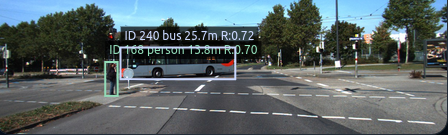
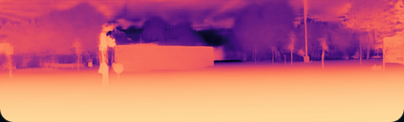
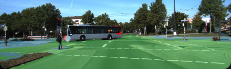
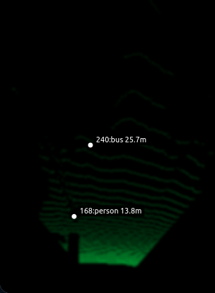
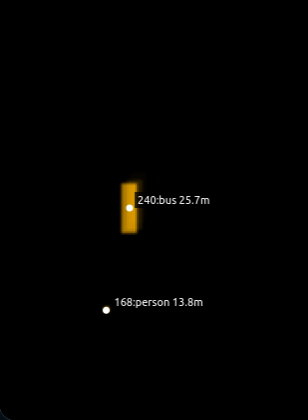
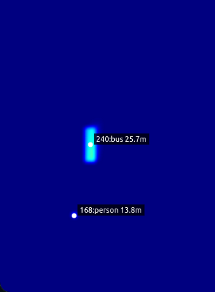

# LiftDepth Risk: Road-Aware Monocular BEV Occupancy and Object Risk


<p align="center">
  
  
  
</p>

<p align="center">
  
  
  
</p>

<p align="center">
  <b>RGB → Metric Depth → Road Segmentation → BEV Road Projection → Object Occupancy → Risk Map</b>
</p>


A lightweight perception pipeline that converts monocular KITTI driving sequences into metric depth, road-aware BEV occupancy, tracked object footprints, and object-aware risk heatmaps.

The project is built as a practical robotics / autonomous-perception demo. It starts from a single RGB camera stream and produces an interactive HTML demo showing how the scene is understood in bird’s-eye view.

---

## Demo Idea

The system answers one question:

> Can we convert monocular driving video into a structured BEV representation of road layout, tracked road users, occupancy, and risk?

The final interactive demo shows six synchronized views:

1. RGB frame with browser-rendered tracked boxes
2. DA2 metric depth map
3. road / sidewalk segmentation
4. projected road BEV
5. object occupancy grid
6. object-aware risk heatmap

---

## Pipeline

```text
RGB frame
   ├── Depth Anything V2 metric depth
   ├── SegFormer road / sidewalk segmentation
   └── YOLO tracking for road users

DA2 depth + KITTI intrinsics + road mask
   └── projected road BEV

YOLO tracks + DA2 depth + road gate
   └── tracked object BEV footprints

object BEV + temporal smoothing
   └── object occupancy grid

occupancy + distance + center corridor + motion
   └── object-aware risk heatmap
```

---

## What This Project Does

This project combines:

* **Monocular metric depth** using Depth Anything V2
* **Road / sidewalk segmentation** using SegFormer Cityscapes models
* **Object detection and tracking** using YOLO
* **Road-gated filtering** to remove irrelevant side detections
* **BEV projection** using KITTI camera intrinsics
* **Object occupancy grid** with rectangular footprints
* **Temporal smoothing** for stable object/risk visualization
* **Static HTML demo export** for interactive playback

---

## Repository Structure

```text
liftdepth-risk/
  README.md
  requirements.txt
  LICENSE_NOTES.md

  docs/
    METHOD.md
    REPRODUCE.md
    GITHUB_PUSH_CHECKLIST.md

  scripts/
    setup_env.sh
    run_final_demo_0005.sh
    run_final_demo_0020.sh

    01_download_kitti_raw_multi.sh
    02_inspect_kitti.py
    03_make_kitti_rgb_video.py

    15_da2_occupancy_grid_video.py
    16_yolo_tracking_video.py
    18_road_segmentation_cache_video.py
    19_road_gated_object_bev_risk.py
    20_export_html_demo_assets.py
```

The following folders are **not included in GitHub**. They are created locally:

```text
external/       third-party repositories, created during setup
checkpoints/    downloaded model checkpoints
data/           KITTI raw data
outputs/        generated caches, videos, metadata
demo/           generated static HTML demo
```

---

## Hardware Used

Development was done on:

```text
GPU: RTX 3050 8GB
RAM: 31GB
OS: Linux
Python: 3.10
```

The pipeline is offline and cache-based, so it does not need to run in real time.

---

## Setup

Create a fresh environment:

```bash
conda create -n liftdepth python=3.10 -y
conda activate liftdepth
```

Install PyTorch for your CUDA version. Example for CUDA 11.8:

```bash
pip install torch torchvision --index-url https://download.pytorch.org/whl/cu118
```

Then run:

```bash
bash scripts/setup_env.sh
```

This script installs the main dependencies, clones Depth Anything V2 into `external/`, and downloads the DA2 metric-depth checkpoint into `checkpoints/`.

After setup, your local folder should contain:

```text
external/Depth-Anything-V2/
checkpoints/depth_anything_v2_metric_vkitti_vits.pth
```

These folders are intentionally ignored by Git.

---

## Manual Setup

If you do not want to use `scripts/setup_env.sh`, run these steps manually.

Install Python dependencies:

```bash
pip install numpy opencv-python pillow tqdm matplotlib
pip install ultralytics
pip install transformers accelerate safetensors
```

Clone Depth Anything V2:

```bash
mkdir -p external checkpoints

git clone https://github.com/DepthAnything/Depth-Anything-V2 external/Depth-Anything-V2
```

Install DA2 metric-depth dependencies:

```bash
pip install -r external/Depth-Anything-V2/metric_depth/requirements.txt
```

Download the DA2 metric-depth checkpoint:

```bash
wget -c \
  "https://huggingface.co/depth-anything/Depth-Anything-V2-Metric-VKITTI-Small/resolve/main/depth_anything_v2_metric_vkitti_vits.pth?download=true" \
  -O checkpoints/depth_anything_v2_metric_vkitti_vits.pth
```

---

## KITTI Raw Data

This project uses KITTI raw synced driving sequences.

Expected local structure:

```text
data/kitti/raw/2011_09_26/
  calib_cam_to_cam.txt
  calib_velo_to_cam.txt
  calib_imu_to_velo.txt

  2011_09_26_drive_0005_sync/
    image_02/data/*.png
    velodyne_points/data/*.bin
    oxts/data/*.txt

  2011_09_26_drive_0020_sync/
    image_02/data/*.png
    velodyne_points/data/*.bin
    oxts/data/*.txt
```

Download selected KITTI drives:

```bash
bash scripts/01_download_kitti_raw_multi.sh
```

Inspect a drive:

```bash
python scripts/02_inspect_kitti.py \
  --date 2011_09_26 \
  --drive 0005
```

Create a simple RGB preview:

```bash
python scripts/03_make_kitti_rgb_video.py \
  --date 2011_09_26 \
  --drive 0005
```

---

## Reproduce Final Demo

The easiest way is:

```bash
bash scripts/run_final_demo_0005.sh
```

This runs the final pipeline and exports the HTML demo.

Open:

```bash
xdg-open demo/kitti_2011_09_26_drive_0005/index.html
```

If your browser blocks local files, run:

```bash
cd demo/kitti_2011_09_26_drive_0005
python -m http.server 8000
```

Then open:

```text
http://localhost:8000
```

---

## Run the Final Pipeline Manually

For drive `0005`:

```bash
python scripts/19_road_gated_object_bev_risk.py \
  --date 2011_09_26 \
  --drive 0005 \
  --yolo-model yolov8m.pt \
  --dilate-road-px 12 \
  --footprint-scale 0.65 \
  --obj-smooth-alpha 0.70 \
  --grid-smooth-alpha 0.20
```

Then export the HTML demo:

```bash
python scripts/20_export_html_demo_assets.py \
  --date 2011_09_26 \
  --drive 0005 \
  --overwrite
```

Open:

```bash
xdg-open demo/kitti_2011_09_26_drive_0005/index.html
```

---

## Important Scripts

### `scripts/15_da2_occupancy_grid_video.py`

Creates DA2 metric depth cache and a dense depth-based occupancy/risk video.

This is useful for debugging the raw depth-to-BEV representation.

---

### `scripts/16_yolo_tracking_video.py`

Runs YOLO detection and tracking.

Default important classes:

```text
person
car
bus
truck
```

Output:

```text
outputs/tracks/yolo/tracks_<date>_drive_<drive>.jsonl
```

---

### `scripts/18_road_segmentation_cache_video.py`

Runs road / sidewalk segmentation using SegFormer.

Output:

```text
outputs/seg_cache/road_seg/<date>/drive_<drive>/<model_name>/*.npy
```

The road mask is used to gate detections so irrelevant side objects are filtered.

---

### `scripts/19_road_gated_object_bev_risk.py`

This is the main final pipeline.

It combines:

* YOLO tracks
* DA2 depth
* road segmentation
* road-gated filtering
* stable object IDs
* rectangular BEV footprints
* temporal smoothing
* risk heatmap generation

Output:

```text
outputs/objects/road_gated_objects_da2_<date>_drive_<drive>.jsonl
outputs/videos/phase10b_road_gated_object_bev_risk_<date>_drive_<drive>.mp4
```

---

### `scripts/20_export_html_demo_assets.py`

Exports the final interactive HTML demo.

Output:

```text
demo/kitti_<date>_drive_<drive>/
  index.html
  metadata.json
  data/
    rgb/
    depth/
    road_overlay/
    road_bev/
    object_occ/
    risk/
    frame_metadata/
```

The HTML draws bounding boxes and BEV labels from JSON metadata instead of burning them into images.

---

## Generated Outputs

During a full run, the project creates:

```text
outputs/
  depth_cache/da2/
  seg_cache/road_seg/
  tracks/yolo/
  objects/
  videos/

demo/
  kitti_2011_09_26_drive_0005/
```

These are generated locally and are ignored by Git.

---

## Why Road Gating?

Raw object detection often finds many vehicles on the side of the road, parked cars, or irrelevant objects.

This project uses semantic road segmentation to filter detections:

```text
vehicle kept only if bbox bottom-center touches dilated road mask
person kept if near road or sidewalk
```

This makes the BEV occupancy and risk map cleaner and more relevant to driving.

---

## Why Object-Aware BEV?

Projecting dense monocular depth directly into BEV can distort large objects. Cars and buses may appear curved or smeared.

Instead, this project uses:

```text
object bbox
  → median depth inside bbox
  → BEV position
  → rectangular object footprint
```

This produces a cleaner object occupancy grid.

---

## Stable IDs

YOLO track IDs can flicker when a vehicle class changes between `car`, `truck`, or `bus`.

The final pipeline uses a stable-ID postprocessor that merges track fragments using:

* vehicle/person superclass
* bbox IoU
* normalized bbox center distance
* short temporal memory

This keeps the visual demo more stable and understandable.

---

## GitHub Notes

Do not push large generated files:

```text
data/
external/
checkpoints/
outputs/
demo/*/data/
*.mp4
```

Recommended first commit:

```bash
git init
git add README.md requirements.txt .gitignore LICENSE_NOTES.md docs scripts
git commit -m "Initial road-aware monocular BEV risk pipeline"
```

---

## Limitations

This is a research / portfolio demo, not a production driving system.

Known limitations:

* monocular depth can have scale and temporal noise
* road segmentation can fail under unusual lighting or occlusion
* YOLO tracking can still switch IDs in difficult cases
* object footprints are approximate axis-aligned rectangles
* risk scoring is heuristic and not a validated safety metric
* KITTI camera is fixed and calibrated; other cameras need their own intrinsics

---

## Project Summary

**LiftDepth Risk** demonstrates a camera-only perception stack for road-scene understanding.

It turns monocular driving video into:

```text
metric depth
road-aware BEV geometry
tracked object occupancy
object-aware risk heatmap
interactive HTML visualization
```

The goal is to present a clean, reproducible robotics perception pipeline that is easy to inspect and extend.
